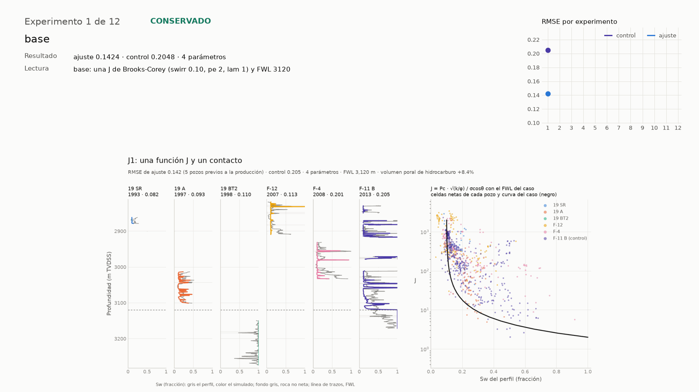

# Simulación numérica con agentes: la función J de Volve en OPM Flow

Material de una clase de 3 h 45 min para ingenieros de reservorios. Un agente de terminal
(Claude Code) maneja un simulador numérico abierto (OPM Flow) para encontrar la función J que
reproduce la saturación de agua de los pozos del campo Volve perfilados antes de producir, con
dos pozos posteriores como control: uno sin barrer y uno barrido.

El ejercicio es el de un programa de saturación-altura. La diferencia es que el cálculo lo hace
el equilibrio del propio simulador, así que lo que se ajusta es lo que después inicializa el
modelo de campo.

Las diapositivas y un resumen con las figuras están en
[clase-opm-agentes.podeley.workers.dev](https://clase-opm-agentes.podeley.workers.dev/).

## Qué se ve en la clase

| Bloque | Tiempo | Qué pasa |
| --- | --- | --- |
| El campo y el dataset | 25 min | Mapa, superficies, secciones, producción y qué pozos sirven para ajustar |
| Lectura rápida de perfiles | 20 min | Arenas, porosidad, agua como BVW, agua irreducible y agua móvil |
| PVT y presiones | 15 min | Densidades, gradientes y los contactos que circulan |
| Instalación | 20 min | OPM Flow en un contenedor, el entorno de Python y Claude Code |
| Pausa | 10 min | |
| Repaso de J y el deck | 25 min | Qué es la función J; el agente lee el deck y muestra dónde vive el ajuste |
| Ajuste de J | 40 min | Una J, el modelo del operador y su forma reajustada; los dos pozos de control |
| Pausa | 10 min | El loop queda corriendo |
| Loop con hipótesis a la vista | 30 min | El agente prueba variantes solo y escribe cada hipótesis antes de correr |
| El contacto de F-4 | 15 min | Contacto inclinado contra agua colgada en una cubeta de la base |
| Controles y cierre | 15 min | Qué revisa y firma el ingeniero, y los límites del ejercicio |

El guion con el minuto a minuto está en `docente/guion.md` y las diapositivas en `slides/clase.md`.

## Instalación

Hace falta Linux, macOS o Windows con WSL (Windows Subsystem for Linux), y cuatro programas:

| Programa | Para qué | Cómo se instala |
| --- | --- | --- |
| Podman o Docker | Correr OPM Flow sin compilarlo | `sudo apt install podman` en Ubuntu, `brew install podman` en macOS |
| uv | El entorno de Python | `curl -LsSf https://astral.sh/uv/install.sh \| sh` |
| git | El historial de experimentos del loop | Viene con casi cualquier sistema |
| Claude Code | El agente | `curl -fsSL https://claude.ai/install.sh \| bash` |

En macOS, Podman necesita una máquina virtual: `podman machine init` y `podman machine start`,
una sola vez.

Con eso instalado:

```bash
git clone https://github.com/mpodeley/clase-opm-agentes.git
cd clase-opm-agentes
instalacion/instalar.sh     # baja la imagen de OPM Flow (1.2 GB), arma el entorno y baja los datos (53 MB)
instalacion/verificar.sh    # corre un caso de prueba y el caso base del ejercicio
```

`verificar.sh` termina con `todo en orden` si las tres piezas funcionan: Flow responde, corre SPE1
(el primer caso comparativo de la Society of Petroleum Engineers) y el caso base del ejercicio da
su puntaje.

Con Docker, anteponé `CONTENEDOR=docker` a los dos comandos. Si ya tenés OPM Flow instalado en el
sistema, exportá `FLOW=/ruta/a/flow` y el contenedor no se usa. En Ubuntu, OPM publica paquetes
propios: las instrucciones están en [opm-project.org](https://opm-project.org).

La imagen del simulador está fijada por su hash en `sw/correr.py`, y los 27 archivos de Volve por
el suyo en `datos/preparar_datos.py`. Dos personas que instalan en días distintos corren lo mismo.

## Los pozos

El campo empezó a producir el 12 de febrero de 2008. El ajuste usa solo pozos perfilados antes.

| Pozo | Perfilado | Hugin (m TVDSS) | Rol |
| --- | --- | --- | --- |
| 15/9-19 SR | 1993 | 2,861 a 2,880 | Ajuste |
| 15/9-19 A | 1997 | 3,013 a 3,101 | Ajuste |
| 15/9-19 BT2 | 1998 | 3,149 a 3,275 | Ajuste, todo en agua |
| 15/9-F-12 | 2007 | 2,818 a 2,910 | Ajuste |
| 15/9-F-4 | 7 y 11 de febrero de 2008 | 2,931 a 3,033 | Ajuste |
| 15/9-F-5 | Fines de julio de 2008 | 3,000 a 3,144 | Control inicial |
| 15/9-F-11 B | A mediados de 2013 | 2,829 a 3,171 | Control barrido |

TVDSS (true vertical depth subsea) es profundidad vertical bajo el nivel del mar. Ningún caso ve
el perfil de los dos pozos de control, y no son equivalentes:

- **F-5** se perfiló cuando el campo había producido 0.5 millones de Sm³ de petróleo, el 5% de lo
  que terminó produciendo, y antes de que el propio F-5 empezara a inyectar. El único inyector
  hasta entonces, F-4, está a 830 m. Vale como estado inicial: un buen modelo tiene que predecirlo.
- **F-11 B** se perforó con 7.75 millones de Sm³ producidos, el 77% del total final, 19 millones
  de Sm³ de agua inyectados y un corte de agua del 85%. Su saturación de agua es igual o mayor
  que la inicial: sirve para detectar un modelo que pone agua de más.

## Correr un caso

```bash
uv run evaluar.py --fragmento
```

Tarda uno o dos segundos. Arma el deck, corre Flow, lee la saturación inicial y la compara con
los perfiles:

```
grafico: corridas/ultima/perfil.png
---
caso: J1: una función J y un contacto
rmse_ajuste: 0.1424
rmse_19-SR: 0.0819
...
rmse_control_inicial: 0.2949
rmse_control_barrido: 0.2048
sesgo_control_barrido: -0.0379
n_parametros: 4
fwl: 3120.0
```

`rmse_ajuste` es la raíz del error cuadrático medio (RMSE, root mean square error): en cada celda
de arena neta del Hugin se resta la Sw del perfil a la simulada, se eleva al cuadrado, se promedia
sobre los cinco pozos de ajuste y se saca la raíz. Queda en unidades de Sw. **Cuanto más chico,
mejor**: cero sería calcar el perfil, y 0.09 quiere decir que el modelo erra unos 9 puntos de
saturación en una celda típica. El cuadrado castiga los errores grandes.

`rmse_control_inicial` es lo mismo en F-5, que el caso no ve y está sin barrer. Si el de ajuste
baja y este sube, el modelo está aprendiendo los pozos y no la roca. `rmse_control_barrido` es
F-11 B, y `sesgo_control_barrido` el promedio de simulado menos perfil en ese pozo: positivo
quiere decir más agua que la que había en 2013. `fwl` es el nivel de agua libre (free water
level) del caso.

El caso se define en `caso.py`, el único archivo que se edita. Con `--fragmento` se imprime además
la parte del deck que decide el caso.

## El modelo y el deck

Una fila de celdas, una por metro de pozo dentro del Hugin. Cada celda lleva su profundidad, su
porosidad, su permeabilidad y una marca de arena neta. Entre celdas no hay flujo: cada una se
equilibra sola, con la función J y el contacto que le asigne el caso.

El deck está partido para que el ajuste se vea. `SW.DATA` es el esqueleto; `MODELO_GRID.INC` y
`MODELO_PROPS.INC` tienen la grilla, la roca y los fluidos, y no cambian. Lo que decide un caso
va en cinco archivos:

| Archivo | Keyword | Qué decide |
| --- | --- | --- |
| `AJUSTE_GRID.INC` | `JFUNC` | El escalado de Leverett y sus exponentes |
| `AJUSTE_PROPS.INC` | `SWOF` | La tabla de J contra Sw de cada región de saturación |
| `AJUSTE_SWL.INC` | `SWL` | El agua irreducible por celda, si el caso la escala |
| `AJUSTE_REGIONES.INC` | `SATNUM`, `EQLNUM` | Qué tabla y qué contacto le toca a cada celda |
| `AJUSTE_SOLUTION.INC` | `EQUIL` | El nivel de agua libre de cada región |

Pasar de un caso a otro es un `diff` de esos archivos.

Los fluidos están fijos y vienen de los datos: 720 kg/m³ para el petróleo y 1,065 kg/m³ para el
agua en reservorio, los que usó el operador en su informe petrofísico de 2006.

## El ejercicio con el agente

```bash
ejercicio/preparar.sh ~/sw-volve
cd ~/sw-volve
claude
```

`preparar.sh` arma una carpeta de trabajo aparte, con su propio `CLAUDE.md`, los permisos del
agente y cuatro pedidos que se le pasan de a uno:

1. Leer y explicar el deck.
2. Ajustar tres casos: una función J, el modelo del operador sin tocar y su forma reajustada.
3. El loop de `program.md`.
4. El contacto de F-4: inclinado, o agua colgada en una cubeta.

El agente puede editar `caso.py` y correr `evaluar.py`; no puede tocar la métrica, los datos ni
salir a internet. Los casos de referencia de `docente/soluciones/` no se copian.

La primera vez, Claude Code pregunta si confiás en la carpeta. Hasta que aceptes, ignora los
permisos de `.claude/settings.json` y pide confirmación para cada comando.

## El loop

`program.md` es una adaptación de [autoresearch](https://github.com/karpathy/autoresearch). El
agente cambia el caso, corre, anota el resultado y conserva o descarta el cambio con git, hasta
12 experimentos o 20 minutos.

Lo que agrega esta versión es que cada experimento es una hipótesis escrita antes de correr. El
mensaje del commit lleva tres líneas, la hipótesis, el mecanismo físico y la predicción, y como
el commit es anterior a la corrida no se puede escribir mirando el resultado.

```bash
uv run bitacora.py --animacion
```

arma `bitacora.html` con todos los experimentos, quedaran o no: hipótesis, predicción, resultado,
lectura, diff del deck y figura. Con `--animacion` suma un reproductor y `animacion.gif`, con un
cuadro por experimento.

El ensayo del 5 de octubre de 2026, 12 experimentos en 9 minutos, está en `docente/plan-b/ensayo/`:



## Resultados de referencia

Salen de `uv run docente/tabla.py`, con los casos de `docente/soluciones/` ajustados por un
optimizador clásico (Nelder-Mead, `docente/optimizar.py`).

| Caso | Ajuste | Control inicial (F-5) | Control barrido (F-11 B) | FWL | Parámetros |
| --- | ---: | ---: | ---: | ---: | ---: |
| Base, sin ajustar | 0.142 | 0.295 | 0.205 | 3,120 m | 4 |
| J1: una función J y un contacto | 0.112 | 0.090 | 0.122 | 3,150 m | 4 |
| OP: el modelo del operador (2006), sin ajustar | 0.122 | 0.302 | 0.197 | 3,120 m | 0 |
| J2: la forma del operador, reajustada | 0.114 | 0.094 | 0.142 | 3,151 m | 5 |
| T: J2 con contacto inclinado 90 m por km | 0.097 | 0.236 | 0.193 | 3,030 a 3,127 m | 6 |
| P: J1 con agua colgada en F-4 | 0.090 | 0.075 | 0.131 | 3,146 m; 3,033 m en F-4 | 5 |

Lo que la clase discute:

- El modelo del operador, sin ajustar nada, queda a 0.010 de una J recién ajustada. Falla en los
  controles: su contacto en 3,120 m queda 24 m dentro de la columna de petróleo de F-5.
- Una función J de cuatro parámetros predice a ciegas el pozo sin barrer con 0.090. El quinto
  parámetro de J2 no baja el error.
- Los ajustes llevan el contacto a 3,150 m, entre el petróleo de 19 A y el agua de 19 BT2. F-5
  tiene petróleo hasta 3,144 m.
- El contacto inclinado baja el error de ajuste 0.017 y rompe los dos controles.
- Un nivel de agua local bajo F-4 baja el error de ajuste 0.022 con un parámetro y mejora el
  control inicial, de 0.090 a 0.075. `uv run web/cubeta.py` muestra que la base del Hugin inclina
  ahí hacia una falla y, si la falla sella, forma una cubeta con derrame entre 3,016 y 3,024 m.

## Qué no se puede afirmar con esto

- **Dónde está el contacto.** Los datos lo dejan entre 3,100 y 3,220 m. El informe del operador
  dice 3,120 ± 15 m, las presiones 3,196 ± 14 m y el modelo de campo 3,200 m. Ningún pozo lo vio.
- **Que el agua de la base de F-4 sea una cubeta.** El perfil pide un nivel local en 3,033 m y la
  estructura lo admite, pero un bloque separado con su propio contacto da el mismo perfil. La
  cubeta depende de qué escalones de la base se toman como falla sellante, y no hay presiones del
  mismo momento en F-4 y en 19 A.
- **Que un pozo de control alcance.** F-5 es uno solo y está en el flanco este. F-11 B, barrido,
  solo dice que el modelo no pone más agua que la que había en 2013.
- **Que estos parámetros sirvan para un modelo de campo.** Son 5 pozos, sin facies ni geomodelo.
  El ejercicio muestra el método de trabajo con el agente.

## Datos

Los perfiles, las trayectorias, los topes, las superficies, la producción, el informe petrofísico
y el de laboratorio son parte del conjunto que Equinor liberó en 2018, y se bajan de espejos
públicos fijados por commit y por hash. Los archivos originales no están en este repositorio;
`docente/plan-b/` guarda decks, tablas y figuras derivados de ellos, bajo la misma licencia.

Datos de Equinor y los ex socios de la licencia Volve (ExxonMobil Exploration & Production Norway
AS, Bayerngas Norge AS), bajo la
[Equinor Open Data Licence](https://cdn.equinor.com/files/h61q9gi9/global/de6532f6134b9a953f6c41bac47a0c055a3712d3.pdf).
El deck SPE1 de `instalacion/` viene de [opm-data](https://github.com/OPM/opm-data), bajo la Open
Database License.

## Pruebas

```bash
uv run pytest
```

Las de `tests/test_flow.py` corren Flow y comparan su saturación inicial contra la fórmula cerrada
de la función J, con y sin agua irreducible por celda.
